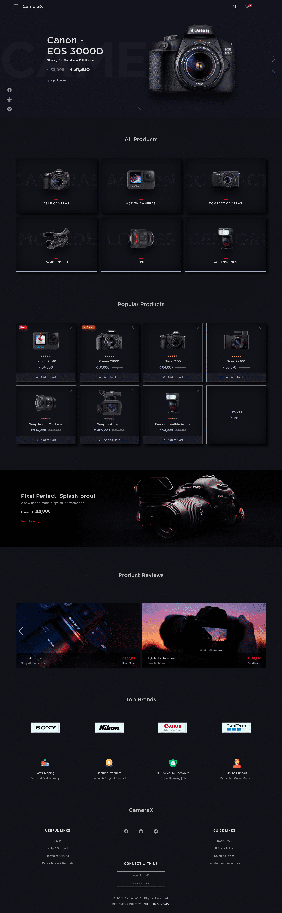

## CameraX - Camera Store - ECOM Website

A modern & retina-friendly eCommerce website built with the aim to engage user experience. It features an elegant & stylish design with a 3D Product Slider, Cart page, & much more.
 

## Preview:

## Features:

- #### **Fully Responsive 💯**
- #### **Multi Page 📰**
- #### **Dark Theme 🎨**
- #### **Cross platform ✅**
 

## Languages used:

- #### **HTML**
- #### **CSS**
- #### **Bootstrap-5**
- #### **jQuery**
 

## Author:

- **Tejodhay Bonam** - **[Portfolio Website](http://www.tejodhay.com/)**, **[Linkedin](https://www.linkedin.com/in/tejodhay-bonam-66b3661b0/)** 
 

## License:

This project is licensed under the  **GPL-3.0** License - see the [LICENSE](LICENSE) file for details.
